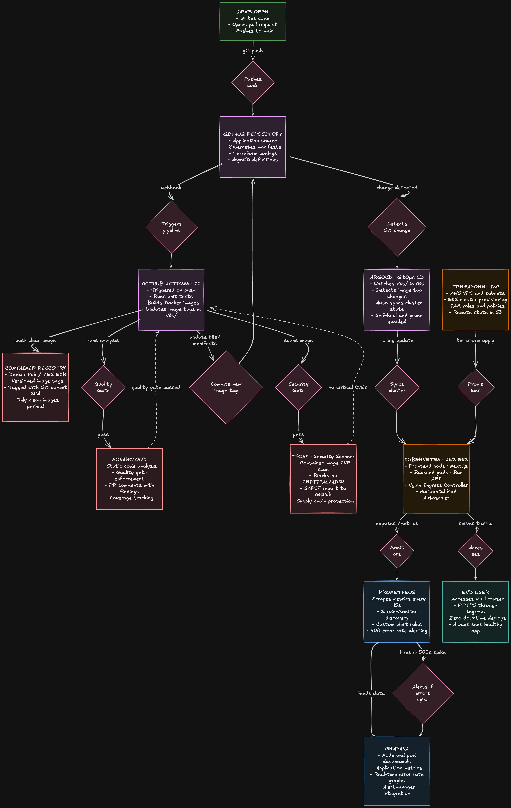

# GitOps Kubernetes CI/CD Platform

> A production-grade, end-to-end DevOps platform that automates the full software delivery lifecycle — from a `git push` to a live, self-healing Kubernetes deployment — with built-in security scanning, code quality gates, and real-time observability.

---

## 📸 Architecture Diagram



---

## ⚡ What This Project Does

This platform eliminates every manual step between writing code and running it in production. A single `git push` triggers a fully automated pipeline that:

1. **Tests** the application and enforces code quality via SonarCloud
2. **Scans** Docker images for vulnerabilities using Trivy before they ever reach a registry
3. **Builds and pushes** versioned container images tagged with the Git commit SHA
4. **Automatically deploys** to Kubernetes using GitOps — no `kubectl apply` ever needed
5. **Self-heals** — if a pod crashes, Kubernetes restarts it with zero human intervention
6. **Monitors** everything with Prometheus and fires alerts the moment error rates spike

---

## 🏗️ Tech Stack

| Layer                      | Technology                                |
| -------------------------- | ----------------------------------------- |
| **Application**            | Next.js 14 (Frontend) · Bun (Backend API) |
| **Containerization**       | Docker · Multi-stage builds               |
| **Orchestration**          | Kubernetes (AWS EKS) · Helm               |
| **Infrastructure as Code** | Terraform · AWS VPC · EKS · S3 · DynamoDB |
| **CI Pipeline**            | GitHub Actions                            |
| **Code Quality**           | SonarCloud (SAST · Quality Gates)         |
| **Security Scanning**      | Trivy (CVE scanning · SARIF reports)      |
| **GitOps / CD**            | ArgoCD                                    |
| **Monitoring**             | Prometheus · Grafana · Alertmanager       |
| **Container Registry**     | Docker Hub / AWS ECR                      |

---

## 🔄 The Full Pipeline — Step by Step

```
Developer pushes code to GitHub
            │
            ▼
┌─────────────────────────────────┐
│      GitHub Actions (CI)        │
│                                 │
│  1. Run unit tests              │
│  2. SonarCloud quality gate     │ ◄── Blocks pipeline on quality violations
│  3. Build Docker images         │
│  4. Trivy vulnerability scan    │ ◄── Blocks on CRITICAL/HIGH CVEs
│  5. Push images to registry     │
│  6. Update image tag in k8s/    │ ◄── Commits new SHA to Git
└────────────────┬────────────────┘
                 │
                 ▼
┌─────────────────────────────────┐
│         ArgoCD (GitOps CD)      │
│                                 │
│  Detects Git change in k8s/     │
│  Syncs cluster to match Git     │ ◄── Declarative, drift-free
│  Rolling update (zero downtime) │
│  Self-heals on pod failure      │
└────────────────┬────────────────┘
                 │
                 ▼
┌─────────────────────────────────┐
│    Kubernetes on AWS EKS        │
│                                 │
│  Next.js frontend pods          │
│  Bun backend pods               │
│  Nginx Ingress Controller       │
│  Horizontal Pod Autoscaler      │
└────────────────┬────────────────┘
                 │
                 ▼
┌─────────────────────────────────┐
│   Prometheus + Grafana Stack    │
│                                 │
│  Scrapes /metrics every 15s     │
│  Dashboards: pods, nodes, app   │
│  Alert: fires on 500 error spike│
└─────────────────────────────────┘
```

---

## 🗂️ Repository Structure

```
GitOps-K8S-Platform/
├── .github/
│   └── workflows/
│       └── ci.yml              # Full CI pipeline definition
├── frontend/
│   ├── Dockerfile              # Multi-stage Next.js build
│   ├── next.config.js
│   ├── sonar-project.properties
│   └── src/
├── backend/
│   ├── Dockerfile              # Bun runtime image
│   ├── index.ts                # API server with /metrics endpoint
│   └── package.json
├── k8s/
│   ├── namespace.yaml
│   ├── frontend/
│   │   ├── deployment.yaml     # Image tag auto-updated by CI
│   │   ├── service.yaml
│   │   └── ingress.yaml
│   ├── backend/
│   │   ├── deployment.yaml
│   │   ├── service.yaml
│   │   └── servicemonitor.yaml # Tells Prometheus where to scrape
│   └── monitoring/
│       └── alert-rules.yaml    # PrometheusRule for 500 error alerting
├── terraform/
│   ├── main.tf
│   ├── variables.tf
│   ├── outputs.tf
│   ├── versions.tf             # Remote state via S3 + DynamoDB locking
│   └── modules/
│       ├── networking/         # VPC, subnets, IGW, NAT Gateway
│       └── eks/                # Managed Kubernetes cluster
├── argocd/
│   └── application.yaml        # GitOps sync configuration
└── docker-compose.yml          # Local development environment
```

---

## 🔐 DevSecOps — Security Built Into the Pipeline

Security is not an afterthought — it is enforced at every stage of the pipeline before code reaches production.

### SonarCloud — Static Analysis & Quality Gates

- Runs on every push and pull request
- Enforces quality gate: pipeline fails if new bugs, vulnerabilities, or code smells are introduced
- Posts detailed analysis as a comment directly on GitHub pull requests
- Coverage tracking ensures test coverage does not regress

### Trivy — Container Vulnerability Scanning

- Scans every Docker image before it is pushed to the registry
- Pipeline hard-fails on any `CRITICAL` or `HIGH` severity CVE
- Results uploaded to GitHub Security tab in SARIF format for full traceability
- Protects against supply-chain attacks from compromised base images

---

## 🏗️ Infrastructure as Code — Terraform

The entire AWS infrastructure is defined in code. Nothing is created by clicking in the console.

**What Terraform provisions:**

- **VPC** with public and private subnets across 2 availability zones
- **Internet Gateway + NAT Gateway** for controlled outbound access from private subnets
- **AWS EKS Cluster** (managed Kubernetes control plane)
- **Managed Node Groups** with auto-scaling (t3.small, 1–3 nodes)
- **IAM roles and policies** for least-privilege access
- **S3 bucket + DynamoDB table** for remote Terraform state with locking

**Remote State:** State is stored remotely in S3, encrypted at rest, with DynamoDB-based locking to prevent concurrent applies from corrupting infrastructure.

```bash
# Provision the entire stack
cd terraform
terraform init
terraform plan
terraform apply

# Tear it all down cleanly
terraform destroy
```

---

## 🔁 GitOps with ArgoCD

ArgoCD runs inside the cluster and continuously watches the `k8s/` directory in this repository. When the CI pipeline commits an updated image tag, ArgoCD detects the change within minutes and automatically reconciles the cluster to match the declared state.

**Key ArgoCD features configured:**

- `automated.prune: true` — removes Kubernetes resources that are deleted from Git
- `automated.selfHeal: true` — reverts any manual changes made directly to the cluster
- Rollback is a `git revert` — full audit trail of every deployment in Git history

---

## 📊 Observability — Prometheus & Grafana

The full `kube-prometheus-stack` is deployed via Helm, giving complete visibility across infrastructure and application layers.

**Metrics collected:**

- Node CPU, memory, and disk usage
- Pod resource consumption and restart counts
- HTTP request rates, latency, and error rates (from `/metrics` endpoint on backend)
- Kubernetes control plane health

**Custom alert configured:**

```yaml
# Fires when backend 500 error rate exceeds 0.1 req/sec for 1 minute
alert: HighErrorRate
expr: rate(http_requests_total{status_code="500"}[5m]) > 0.1
severity: critical
```

**Pre-built Grafana dashboards imported:**

- Node Exporter Full (Dashboard ID: 1860)
- Kubernetes Pods Overview (Dashboard ID: 6417)

---

## 🚀 Running Locally

### Prerequisites

Make sure the following are installed before you begin:

| Tool                                                                 | Purpose                    |
| -------------------------------------------------------------------- | -------------------------- |
| [Docker Desktop](https://www.docker.com/products/docker-desktop/)    | Container runtime          |
| [Kind](https://kind.sigs.k8s.io/docs/user/quick-start/#installation) | Local Kubernetes cluster   |
| [kubectl](https://kubernetes.io/docs/tasks/tools/)                   | Kubernetes CLI             |
| [Helm](https://helm.sh/docs/intro/install/)                          | Kubernetes package manager |
| [Node.js 20+](https://nodejs.org/)                                   | Frontend runtime           |
| [Bun](https://bun.sh/)                                               | Backend runtime            |

### Step 1 — Clone the repository

```bash
git clone https://github.com/Taher2512/GitOps-K8S-Platform
cd GitOps-K8S-Platform
```

### Step 2 — Reset and create the local Kind cluster

> If you have a previous cluster running, this clears it cleanly first.

```bash
# Kill any lingering kubectl processes
killall kubectl

# Delete any existing local cluster
kind delete cluster -n local

# Create a fresh cluster using the config file
kind create cluster --config clusters.yml -n local
```

### Step 3 — Install the Nginx Ingress Controller

```bash
kubectl apply -f https://raw.githubusercontent.com/kubernetes/ingress-nginx/main/deploy/static/provider/kind/deploy.yaml
```

### Step 4 — Install and configure ArgoCD

```bash
# Create the ArgoCD namespace
kubectl create namespace argocd

# Install ArgoCD
kubectl apply -n argocd -f https://raw.githubusercontent.com/argoproj/argo-cd/stable/manifests/install.yaml

# Apply the GitOps application definition — ArgoCD takes over deployments from here
kubectl apply -f argocd/application.yaml
```

### Step 5 — Access the ArgoCD UI

```bash
# Port-forward ArgoCD to localhost
kubectl port-forward svc/argocd-server -n argocd 8080:443

# Retrieve the initial admin password
kubectl -n argocd get secret argocd-initial-admin-secret -o jsonpath="{.data.password}" | base64 -d
```

Open **https://localhost:8080** → login with `admin` and the password above.

### Step 6 — Expose the application via Ingress

```bash
# Port-forward the Nginx ingress controller (runs in background)
kubectl port-forward --namespace=ingress-nginx service/ingress-nginx-controller 8081:80 &
```

### Step 7 — Install the monitoring stack

```bash
helm install monitoring prometheus-community/kube-prometheus-stack \
  --namespace monitoring \
  --create-namespace \
  --set grafana.adminPassword=yourpassword

# Watch pods come up
kubectl get pods -n monitoring

# Port-forward Grafana to localhost
kubectl port-forward svc/monitoring-grafana -n monitoring 3000:80
```

### Step 8 — Push changes (triggers the CI pipeline)

```bash
git add .
git commit -m "your commit message"
git pull --rebase origin main
git push
```

### Local Service Endpoints

| Service         | URL                            | Notes                   |
| --------------- | ------------------------------ | ----------------------- |
| **ArgoCD UI**   | https://localhost:8080         | GitOps dashboard        |
| **Frontend**    | http://localhost:8081          | Next.js app via Ingress |
| **Backend API** | http://localhost:8081/api/data | Bun API via Ingress     |
| **Grafana**     | http://localhost:3000          | Monitoring dashboards   |

---

## 🖥️ Screenshots

### ArgoCD — GitOps Sync Dashboard

<!-- Attach a screenshot of your ArgoCD UI showing the application graph with synced pods -->
<!-- Recommended filename: screenshots/argocd-dashboard.png -->


### Grafana — Kubernetes Monitoring Dashboard

<!-- Attach a screenshot of your Grafana dashboard showing pod metrics and the error rate panel -->
<!-- Recommended filename: screenshots/grafana-dashboard.png -->


---

## 🔑 Required GitHub Secrets

| Secret                  | Where to Get It                          |
| ----------------------- | ---------------------------------------- |
| `DOCKERHUB_USERNAME`    | Your Docker Hub username                 |
| `DOCKERHUB_TOKEN`       | Docker Hub → Account Settings → Security |
| `SONAR_TOKEN`           | SonarCloud → My Account → Security       |
| `AWS_ACCESS_KEY_ID`     | AWS IAM → Create access key              |
| `AWS_SECRET_ACCESS_KEY` | AWS IAM → Create access key              |

---

## 🧠 Key Engineering Decisions

**Why GitOps over push-based CD?**
Push-based deployment (e.g., `kubectl apply` directly from CI) means the cluster state can drift from what is in Git — someone could apply a hotfix manually and it would never be recorded. With ArgoCD, Git is the single source of truth. The cluster always reflects exactly what is committed.

**Why Trivy before pushing to the registry?**
Once a vulnerable image reaches a registry, it can be pulled by other systems or environments. Scanning before the push ensures a vulnerable image never exists in any shared registry — not even briefly.

**Why multi-stage Docker builds?**
The final production image contains only the compiled output and runtime — not the build tools, source code, or dev dependencies. This reduces attack surface and image size significantly.

**Why remote Terraform state?**
Local state files cannot be shared across team members or CI pipelines safely. Remote state in S3 with DynamoDB locking ensures no two applies ever run concurrently and corrupt the state file.

---

## 📈 What I Learned Building This

- How GitOps fundamentally differs from traditional CI/CD push models
- Why Kubernetes liveness and readiness probes are essential for real self-healing
- How Terraform modules enable infrastructure reuse across environments
- How Prometheus scrapes work and why service discovery via `ServiceMonitor` is better than static config
- The difference between a security scan that reports findings and one that actually blocks a pipeline

---

## 📄 License

MIT — feel free to fork and adapt for your own projects.
